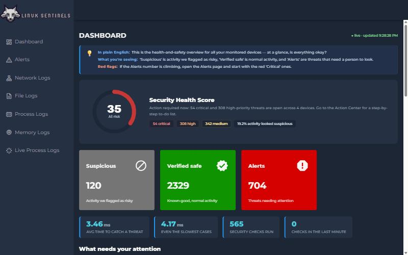
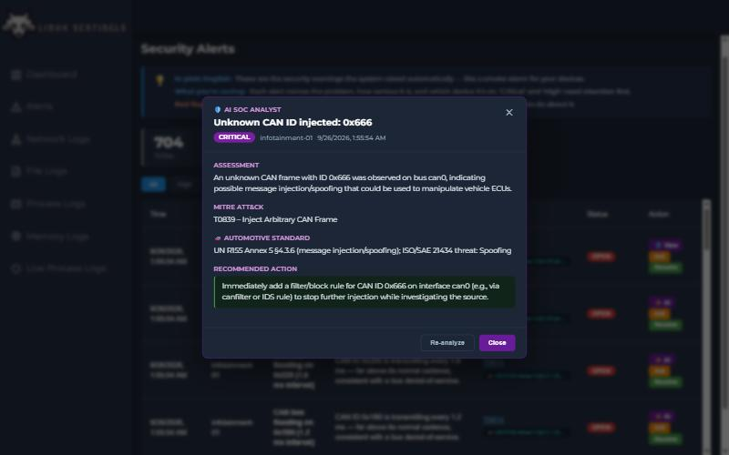
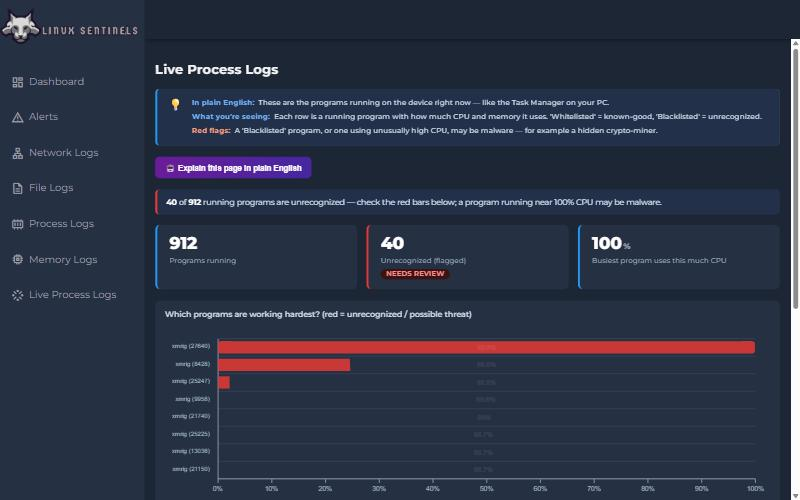
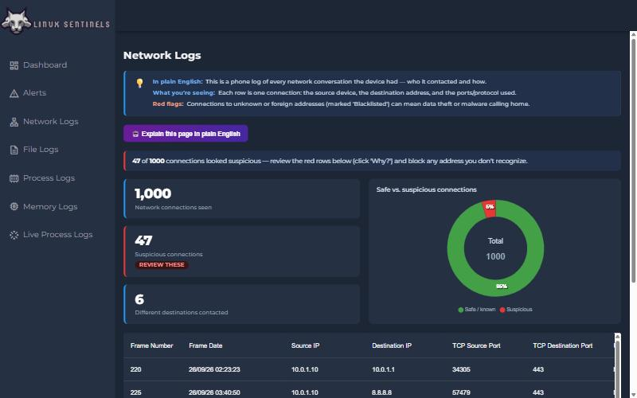

<div align="center">

# 🔬 KURNICUS
### Real-Time, Low-Power Security Telemetry & AI Detection for Any Linux / Edge Device

*Detect threats at the edge in milliseconds — on hardware that sips power — with an AI analyst that explains every alert in plain English.*


</div>

---

## Screenshots

| Dashboard — health score, live metrics, "what needs attention" | AI SOC Analyst — plain-English explanation + fix |
|---|---|
|  |  |
| **Live Process — crypto-miner caught (red)** | **Network — safe vs. suspicious** |
|  |  |

---

## What is Kurnicus?

Kurnicus is a **host-based security monitoring and anomaly-detection platform** for Linux and edge devices. It collects OS telemetry (network, processes, memory, files, logins, and vehicle CAN bus), learns each device's *normal* behaviour, and flags anomalies **in real time** — then an optional AI analyst turns each alert into a plain-English explanation with a recommended fix.

It is built for the devices big-tech tooling ignores: **automotive ECUs, IoT, industrial/OT, medical, kiosks, and constrained servers** — anything running Linux that can't afford a heavy agent or a round-trip to a GPU farm.

**Two design principles make it different:**

- **Detect at the edge, in milliseconds.** A streaming machine-learning model scores every event on the device's own CPU in ~3 ms — no GPU, no cloud round-trip required for detection.
- **Explain, don't just alarm.** Every screen describes *what you're seeing, whether it's a problem, and what to do* — and an AI analyst is one click away for a deeper, plain-English breakdown.

---

## Why Kurnicus?

| Area | Typical tools (Falco / Wazuh / Osquery) | Kurnicus |
|------|------------------------------------------|----------|
| **Detection latency** | Batch / rule evaluation | **~3 ms per event** (streaming ML) |
| **Idle power** | Constant polling | **~0% CPU** — event-driven (DB `LISTEN/NOTIFY`) |
| **Footprint** | Heavy for embedded | **~150 MB RAM**, CPU-only, runs on a Raspberry Pi |
| **Detection method** | Signatures / static rules | **Behavioural anomaly detection** that learns per-device baselines |
| **Explainability** | Cryptic alerts | **Plain-English on every tab** + AI SOC analyst |
| **Scope** | Server-centric | **Any device** — automotive, IoT, industrial, medical, servers |
| **Setup** | YAML/JSON rule tuning | **One command** (`docker compose up`) + self-learning thresholds |

---

## Key Features

### ⚡ Real-time detection engine
- **Streaming anomaly detection** with [River](https://riverml.xyz) (Half-Space Trees) — online, incremental, pure-Python, CPU-only. Learns a separate baseline **per host and per data source**.
- **Event-driven** via PostgreSQL `LISTEN/NOTIFY` — the detector sleeps until an event arrives, so idle power is near zero.
- **Measured ~3 ms** end-to-end detection latency (event → scored), instrumented and shown live on the dashboard.
- Per-host models are **persisted to disk**, so baselines survive reboots.
- A complementary **Isolation Forest** batch detector for deeper offline sweeps.

### 🤖 AI SOC analyst (optional)
- Powered by **NVIDIA NIM** (OpenAI-compatible) — no local GPU needed.
- **Explain any alert** → *Assessment · MITRE ATT&CK · Recommended action*, using the real telemetry (PIDs, IPs, hostnames).
- **"Explain this page in plain English"** on every tab → *What this shows · Anything wrong? · What to do*.
- The AI is **off the detection hot-path** — an offline device is still fully protected.

### 🧭 Understandable by anyone
- **Security Health Score** (0–100) — one number for "are my devices safe?"
- **Action Center** (built into the dashboard) — a prioritized *"what to review, why it matters, and how to fix it"* to-do list.
- Every log tab leads with plain-language explanations, charts, colour-coded status, and value-aware summaries — not raw numbers.
- Per-row **"Why?"** explanations on suspicious network connections.
- **Live-updating** dashboard.

### 🌐 Multi-domain telemetry (configurable to any device)
| Source | Detects |
|--------|---------|
| Network | Suspicious/unknown outbound connections, C2 "calling home" |
| Live processes | Rogue/high-CPU programs (e.g. crypto-miners) |
| Memory | Abnormal memory pressure |
| Files | Access to sensitive files (e.g. credential stores) |
| **Auth / login** | **Brute-force / password-guessing (MITRE T1110)** |
| **CAN bus (automotive)** | **Message injection & bus flooding → UN R155 / ISO 21434** |

Telemetry is stored as generic JSON events, so **adding a new source** (CPU temperature, disk/SMART, USB, GPS, Modbus/OT, syslog…) is just a payload + a feature function — the alerts, AI, and UI work automatically.

---

## Architecture (platform/)

```
        Monitored devices (Linux / ECU / IoT / server)
        telemetry: network · process · memory · file · auth · CAN bus
                              │  events (JSON)
                              ▼
                 ┌───────────────────────────┐
                 │   PostgreSQL (events)      │
                 │   JSONB payloads, per-host │
                 └─────────────┬─────────────┘
                 LISTEN/NOTIFY │ (push, no polling)
              ┌────────────────┴───────────────┐
              ▼                                 ▼
   ┌────────────────────┐            ┌────────────────────┐
   │ Streaming detector │            │  Batch detector    │
   │ River HST (~3 ms)  │            │  Isolation Forest  │
   └─────────┬──────────┘            └─────────┬──────────┘
             └───────────────┬─────────────────┘
                             ▼  alerts (severity · MITRE · standard_ref)
                 ┌───────────────────────────┐
                 │   FastAPI  (asyncpg)       │──►  AI SOC analyst (NVIDIA NIM)
                 └─────────────┬─────────────┘
                               ▼  REST
                 ┌───────────────────────────┐
                 │  React dashboard (Vite)    │
                 │  Health score · Action     │
                 │  Center · live log views   │
                 └───────────────────────────┘
```

---

## Quick Start (recommended — `platform/`)

**Prerequisites:** Docker + Docker Compose.

```bash
cd platform
docker compose up --build -d      # PostgreSQL + FastAPI
docker compose run --rm seed      # load synthetic multi-device telemetry
```

Verify:

```bash
curl http://localhost:8000/health          # {"status":"ok"}
# interactive API docs: http://localhost:8000/docs
```

Run detection:

```bash
docker compose run --rm detector                       # one-shot batch scan
docker compose --profile realtime up -d stream         # real-time streaming detector
docker compose --profile realtime run --rm streamgen \
  sh -c "pip install -q -r requirements.txt && python stream_events.py --rate 20 --duration 40"
```

Run the dashboard:

```bash
cd ../Linux_Sentinel/frontend
npm install
npm run dev             # http://localhost:5173  (talks to the API on :8000)
```

### Enable the AI analyst (optional)
Get a free API key at **[build.nvidia.com](https://build.nvidia.com)**, then:

```bash
cd platform
cp .env.example .env            # add NVIDIA_API_KEY (this file is git-ignored)
docker compose up -d api
```

> Detection works fully **without** a key — the AI layer only adds human-friendly explanations.

---

## Project Structure

```
kurnicus/
├── platform/                     # ✅ Current stack (Postgres + FastAPI + Docker)
│   ├── api/                      #   FastAPI: alerts, metrics, health score,
│   │                             #   recommendations, AI insights (ai.py)
│   ├── detector/                 #   detect.py (Isolation Forest, batch)
│   │                             #   stream.py (River streaming, real-time)
│   ├── db/                       #   schema.sql + migrations
│   ├── seed/                     #   synthetic telemetry + live stream generator
│   └── docker-compose.yml
│
├── Linux_Sentinel/               # Web dashboard
│   ├── frontend/                 #   React 18 + Vite + MUI + ApexCharts
│   └── backend/                  #   legacy Flask API (superseded by platform/api)
│
└── FInal_OSTelem2/FInal_OSTelem/ # Legacy bash agent (v1: agent → EC2 → S3)
    ├── SERVICEFILE/              #   telemetry scripts + orchestrator
    ├── Cloud/                    #   EC2 receiver
    └── requirement/, Exploits/, Documentations/
```

> **Note:** the legacy bash-agent → EC2 → S3 pipeline (`FInal_OSTelem2/`) is the original v1 and still works; the `platform/` stack is the current, self-contained, real-time replacement.

---

## Tech Stack

| Layer | Technologies |
|-------|-------------|
| Data store | PostgreSQL 16 (JSONB events, `LISTEN/NOTIFY`) |
| API | FastAPI, asyncpg, Uvicorn |
| Detection | River (Half-Space Trees), scikit-learn (Isolation Forest), NumPy |
| AI | NVIDIA NIM (OpenAI-compatible), `openai` client |
| Frontend | React 18, Vite, Material UI, ApexCharts, Axios |
| Orchestration | Docker Compose |
| Legacy agent | Bash, tshark, sysstat, iotop, ioping, boto3, AWS S3/EC2 |

---

## Compliance & Standards

- **UN Regulation No. 155** — automotive cybersecurity; CAN bus alerts map to Annex 5 threat categories (message injection §4.3.6, DoS §4.3.1).
- **ISO/SAE 21434** — road-vehicle cybersecurity engineering (Spoofing / Availability / Tampering threat classes).
- **MITRE ATT&CK** — every alert carries the most relevant technique id (e.g. T1496 resource hijacking, T1110 brute force, T1071 C2, T1003 credential access).

---

## Target Users

- **Automotive** — runtime intrusion detection for Linux-based ECUs and in-vehicle networks
- **IoT & embedded** — behavioural monitoring for constrained devices at scale
- **Industrial / OT, medical, kiosks** — configurable telemetry + detection for any Linux endpoint
- **DevOps / SecOps** — unified, low-overhead observability across a Linux fleet

---

## ⚠️ Security

- **No secrets in the repo.** Credentials load from environment variables / `.env` files (git-ignored). `platform/.env.example` documents the AI key; `platform/.env` is never committed.
- The legacy `FInal_OSTelem2/.../Cloud/config.json` uses placeholder values — fill in your own before deploying.
- Scripts under `Exploits/` are for **authorized security testing only**, on systems you own or have explicit permission to test.
